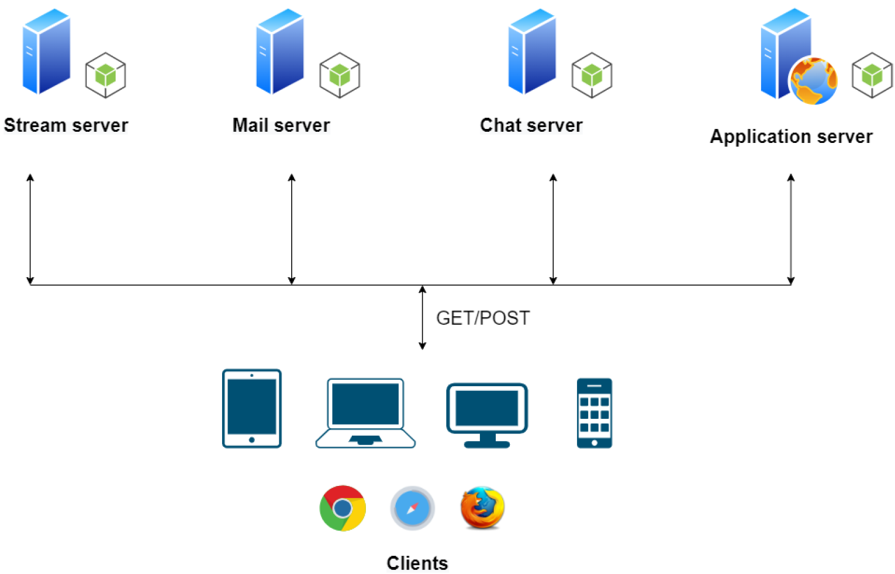

# Web Radio Streaming Platform Using Bootstrap and Node.js
This repository refers to a custom-created multimedia streaming platform. A web-based music radio was developed using [#Node.js](https://nodejs.org/en) for the backend implementation of all servers, [#Bootstrap-5](https://getbootstrap.com/) framework for the frontend client-side design, and even more JavaScript modules. The application supports a multi-device **mp3 streaming** functionality, **e-mail sending**, and **chatting** between the users currently listening to their favorite music.

<br>

## 📢Note📢
🎯Please, clone this repository before reading the description. Don't forget to like👍and share your thoughts😊.

<br>

## Modules and Versions
During the development phases, many different development techniques were chosen to achieve the end goal as efficiently as possible. More specifically, HTML5 code was used to structure the content, CSS3 rules to modify the design, and JavaScript code to provide the basic functionality regarding the client-side implementation. Node.js was picked for server implementation. A table containing the most important libraries used by the four different servers (and consequently by Node.js) is displayed below.

| **Module**      | **Version** | **Use**                     |
|-----------------|-------------|-----------------------------|
| express         | 4.17.2      | Host & port initialization. |
| express-session | 1.17.2      | Sessio creations.           |
| cookie-parser   | 1.4.6       | Cookie creations.           |
| axios           | 0.24.0      | mp3 streaming.              |
| body-parser     | 1.19.1      | Json files handler.         |
| nodemailer      | 6.7.2       | Email sending.              |
| socket.io       | 4.4.0       | User chatting.              |

Additionally, for the front-end part, the Bootstrap framework was used, coming with its (at the time) latest version, which is 5.1.3.

<br>

## Execution Instructions
In order for any user to run the software on their computer, they are required to follow the following steps.

1. Make sure you have Node.js installed on your computer. If not, then click [here](https://nodejs.org/en/download/) and follow the detailed instructions provided to install it.

2. Navigate to the directory where you previously installed the software and visit the ```~/app``` folder.

3. Considering you're inside that folder, open four command prompt windows (```cmd```).
Note: It helps in this case to use screen divided mode if your operating system supports it.

4. In the 1st command prompt window, start the song server by typing ```node unicast-song-server.js``` and pressing enter.

5. In the 2nd command prompt window, start the chat server by typing ```node chat-server.js``` and pressing enter.

6. In the 3rd command prompt window, start the application server by typing ```node app-server.js``` and pressing enter.

7. In the 4th command prompt window, start the application by typing ```node app.js``` and pressing enter.

8. With a browser of your choice, visit ```http://localhost:8080``` and enjoy the radio content.

<br>

## Architecture
An architecture diagram based on the software structure displaying the four different servers, as well as the communication happening between them, follows.


<br>

## Hints
The menu is constructed in such a way as to ensure a full understanding of the possibilities offered by the radio. If a user has administrator rights, he has every right, whenever he wishes, to modify the stream that is heard at the given time by all listeners, setting the playlist of his choice each time. The only necessary hint to avoid errors and exceptions is every time before pressing the "play" button on the live section of our page, to wait for it to be fully loaded.

<br>

## Browser Compatibility Limitations
So far, no problem has been observed in terms of browser compatibility. The software is tested and performs perfectly in Chrome, Mozilla, Microsoft Edge, and Safari. If there is a technical issue with a different browser or with an older version of the aforementioned, please report it to the authors.

<br>

## Stored Admins
There are two admins stored. A table containing their information follows.

| **Username**     | **Password** |
|------------------|--------------|
| bobos@aueb.gr    | Dogpassword  |
| funkyCat@aueb.gr | ilovedogs    |

<br>

## License
This project is licensed under the **MIT License** - see the **[LICENSE](LICENSE)** file for details.
